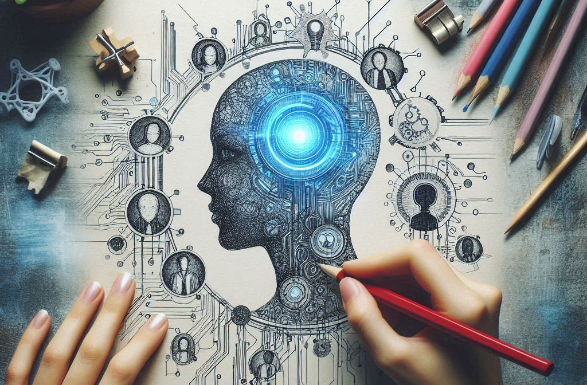

Estamos vivendo uma revolução silenciosa (talvez nem tão silenciosa assim). Ao contrário de outras grandes mudanças tecnológicas, essa está acontecendo sem que percebamos. E é sobre isso que vamos falar hoje: a era da inteligência artificial generativa. Sabe aquela sensação de que o futuro chegou? Pois é, ele está aqui e está transformando tudo ao nosso redor. Mas será que devemos ter medo do que está por vir? Vamos descobrir juntos.

A inteligência artificial generativa é, basicamente, um tipo de inteligência artificial que cria novos conteúdos. Ela pode escrever textos, compor músicas, desenhar imagens e até programar! Diferente da IA tradicional, que responde a comandos e executa tarefas específicas, a IA generativa é capaz de criar algo novo, praticamente do zero. **É como se você tivesse um artista digital trabalhando para você 24 horas por dia.**

Mas de onde veio essa maravilha tecnológica? Sua origem remonta a décadas de pesquisa em redes neurais e aprendizado profundo (deep learning). Podemos traçar suas raízes até os anos 1950, com Alan Turing e sua famosa pergunta: **_“As máquinas podem pensar?”_** No entanto, foi só nas últimas duas décadas que vimos avanços significativos, com a criação de algoritmos como o GPT (Generative Pre-trained Transformer) da OpenAI. A evolução da capacidade de processamento dos computadores e o acesso a grandes volumes de dados foram cruciais para essa transformação.

O principal propósito da IA generativa é aumentar a criatividade humana. Parece contraditório, né? Afinal, máquinas sendo criativas? Mas é isso mesmo. Elas são ferramentas poderosas que podem nos ajudar a explorar novas fronteiras na arte, na ciência e nos negócios. Como disse Marcel Proust, “A verdadeira viagem de descobrimento não consiste em procurar novas paisagens, mas em ter novos olhos”. A IA generativa nos dá esses novos olhos.

Claro, toda revolução vem acompanhada de medos e incertezas. As pessoas temem que a IA generativa possa substituir empregos, invadir a privacidade e até criar uma realidade que não podemos distinguir da ficção. Elon Musk, por exemplo, já alertou sobre os perigos da inteligência artificial descontrolada. Mas será que esses medos são justificados? Ou será que estamos apenas resistindo a uma mudança inevitável?

A IA generativa já está deixando sua marca em diversas áreas. No marketing, ela está criando anúncios personalizados que são muito mais eficazes. Na saúde, está ajudando a desenvolver novos medicamentos em tempo recorde. Na arte, está colaborando com artistas humanos para criar obras de arte incríveis. E isso é só o começo. A cada dia, novas aplicações surgem, mostrando que o potencial dessa tecnologia é praticamente ilimitado.

Infelizmente, nem tudo são flores. A IA generativa também está sendo usada para criar fake news, deepfakes e outras formas de desinformação. Isso é um problema sério, pois essas tecnologias podem manipular a opinião pública e causar danos reais. Precisamos estar vigilantes e desenvolver mecanismos para identificar e combater esses abusos. Como disse George Orwell, **“Em tempos de engano universal, dizer a verdade é um ato revolucionário”.**

Não dá para negar que algumas profissões estão em risco. Atividades repetitivas e previsíveis, como atendimento ao cliente e análises de dados simples, podem ser facilmente automatizadas. Isso pode parecer assustador, mas também pode ser uma oportunidade. Ao liberar as pessoas dessas tarefas tediosas, a IA permite que elas se concentrem em atividades mais criativas e gratificantes.

Por outro lado, a IA generativa está criando novas profissões. Desenvolvedores de IA, eticistas de tecnologia, treinadores de robôs e designers de algoritmos são apenas algumas das novas carreiras que estão surgindo. Além disso, profissões tradicionais estão se transformando. Escritores, por exemplo, agora podem trabalhar em conjunto com IA para criar conteúdos mais ricos e diversos.

E aí, como você pode tirar proveito dessa tecnologia? A primeira coisa é perder o medo. Entenda que a IA generativa é uma ferramenta, e como qualquer ferramenta, seu valor depende de como você a usa. Estude, experimente, seja curioso. Use a IA para aumentar sua criatividade, melhorar sua produtividade e explorar novas possibilidades. Como disse Steve Jobs:

> A inovação distingue um líder de um seguidor.

A era da inteligência artificial generativa está só começando, e as possibilidades são infinitas. Mas para aproveitar ao máximo essa revolução, precisamos estar preparados para enfrentar seus desafios e explorar suas oportunidades. Não tenha medo do que está por vir. Em vez disso, abrace o futuro e use essa tecnologia incrível a seu favor.

A era da inteligência artificial generativa está trazendo à tona debates que vão além da tecnologia. Estamos falando de uma mudança de paradigma que impacta nossa sociedade, nossa forma de trabalhar e até mesmo nossa percepção da realidade. Yuval Noah Harari, historiador e autor de “Sapiens” e “Homo Deus”, frequentemente alerta para o fato de que a inteligência artificial pode transformar a economia global de maneiras que ainda não compreendemos totalmente. Ele destaca que estamos apenas começando a arranhar a superfície do que a IA pode fazer, e as implicações disso são imensas.

Uma das áreas onde a IA generativa já está fazendo uma diferença significativa é na medicina. Imagine um mundo onde diagnósticos médicos são feitos com uma precisão incrível, onde novos medicamentos são desenvolvidos em uma fração do tempo que levava anteriormente. Esse mundo não está tão distante. Pesquisadores estão usando IA para analisar grandes volumes de dados médicos e identificar padrões que seriam impossíveis de detectar por humanos. Isso está levando a avanços significativos no tratamento de doenças complexas como o câncer e doenças neurodegenerativas.

No entanto, o impacto da IA generativa vai muito além da medicina. No campo da educação, por exemplo, estamos vendo o surgimento de tutores virtuais que podem personalizar o aprendizado de cada aluno, adaptando-se ao seu ritmo e estilo de aprendizado. Isso poderia revolucionar a educação, tornando-a mais inclusiva e eficaz. Além disso, na área de entretenimento, a IA está sendo usada para criar roteiros de filmes, compor trilhas sonoras e até mesmo gerar gráficos e animações, abrindo novas possibilidades para cineastas e artistas.

Mas, como em qualquer revolução, há um lado sombrio. A capacidade da IA de gerar conteúdos realistas levanta questões éticas profundas. Deepfakes, por exemplo, são vídeos falsos extremamente realistas criados com a ajuda de IA. Eles têm o potencial de causar sérios danos, desde difamação até manipulação política. Além disso, a proliferação de fake news alimentada por IA pode desestabilizar democracias e minar a confiança pública nas instituições. Estamos entrando em um terreno onde a linha entre a realidade e a ficção se torna cada vez mais tênue.

Outro ponto crítico é o impacto da IA no mercado de trabalho. Profissões que dependem de tarefas repetitivas e previsíveis estão particularmente em risco. De acordo com um relatório do Fórum Econômico Mundial, até 2025, a automação pode eliminar 85 milhões de empregos. No entanto, o mesmo relatório também prevê a criação de 97 milhões de novos empregos que exigem habilidades que só os humanos possuem, como criatividade, pensamento crítico e empatia. Portanto, a chave para o futuro do trabalho é a adaptação. Precisamos nos preparar para aprender novas habilidades e nos reinventar continuamente.

Então, como as pessoas inteligentes podem usar a IA generativa a seu favor? Primeiro, é crucial manter-se atualizado com os avanços da tecnologia. A aprendizagem contínua é a nova norma. Plataformas de educação online como Coursera e Udacity oferecem cursos sobre IA e suas aplicações. Além disso, é importante experimentar e ser curioso. Brinque com ferramentas de IA, participe de comunidades de desenvolvedores e colabore com outras pessoas que compartilham seus interesses. A IA não é um substituto para a criatividade humana, mas uma ferramenta poderosa que pode amplificar nossas capacidades.

A era da inteligência artificial generativa está só começando, e as possibilidades são infinitas. Mas para aproveitar ao máximo essa revolução, precisamos estar preparados para enfrentar seus desafios e explorar suas oportunidades. Não tenha medo do que está por vir. Em vez disso, abrace o futuro e use essa tecnologia incrível a seu favor.

Agora é com você. O que acha da IA generativa? Está otimista ou preocupado?

Vamos transformar esse medo em curiosidade e essa curiosidade em ação. O futuro está na palma da nossa mão. E você, está pronto para embarcar nessa jornada?
