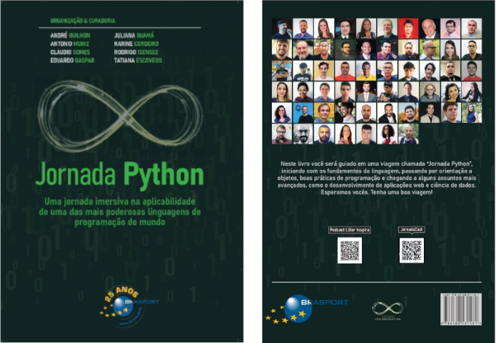

## Descubra a Magia da "Jornada Python": Uma Viagem Colaborativa e Inspiradora

Olá, pessoal! Hoje vou compartilhar uma experiência incrível que tive recentemente: minha participação como co-autor no livro "Jornada Python". Se você é apaixonado por programação, tecnologia e colaboração em equipe, continue lendo, porque esta jornada vai te inspirar.

#### Inicio da jornada

"Jornada Python" é mais que um livro; é uma verdadeira viagem através do mundo da programação em Python, desde os fundamentos até tópicos avançados. É fruto de um trabalho colaborativo entre vários especialistas apaixonados pela linguagem. A ideia nasceu de um desejo de criar algo que pudesse educar e inspirar desenvolvedores, e foi concretizada graças ao esforço coletivo de muitos talentos.

Tudo começou com a visão de um professor universitário que sonhava em lançar um livro após finalizar seu mestrado em 2006. Esse sonho começou a se tornar realidade em 2017, com a criação do "Jornada DevOps". Após alguns obstáculos, a ideia evoluiu para incluir a escrita colaborativa, culminando na publicação de vários livros, incluindo o "Jornada Python".

#### A Magia da Colaboração

A jornada colaborativa é fascinante. São dezenas de pessoas contribuindo com suas experiências e conhecimentos para criar algo significativo. Como disse Helen Keller, **"Sozinhos podemos fazer tão pouco; juntos podemos fazer tanto."** Essa citação resume perfeitamente o espírito por trás do "Jornada Python". Cada autor trouxe seu toque especial, resultando em um livro rico e diversificado.

A metodologia ágil foi um pilar essencial durante a criação deste livro. Utilizando princípios ágeis, como sprints e feedback contínuo, conseguimos coordenar os esforços de todos os colaboradores de maneira eficiente e produtiva. A liderança dentro da equipe foi crucial para manter a motivação e o foco, garantindo que cada capítulo fosse desenvolvido com alta qualidade.

A criação de um livro desse tipo geralmente envolve várias etapas, incluindo planejamento, pesquisa, escrita, revisão e publicação. Aqui está uma visão geral de como um livro técnico como "Jornada Python" pode ser feito:

1. **Planejamento**: Definir o público-alvo e os objetivos do livro. Estruturar os tópicos a serem abordados e criar um esboço detalhado dos capítulos.

2. **Pesquisa e Conteúdo**: Reunir informações relevantes, exemplos de código, estudos de caso e melhores práticas. Os autores podem basear-se em sua experiência prática, em documentação oficial e em outros recursos confiáveis.

3. **Escrita**: Redigir os capítulos de acordo com o esboço planejado. Isso envolve a explicação clara dos conceitos, a inclusão de exemplos práticos e a construção de exercícios para os leitores.

4. **Revisão Técnica**: Revisar o conteúdo para garantir a precisão técnica. Isso pode envolver a colaboração com outros especialistas em Python para validar o material.

5. **Edição**: Melhorar a clareza, a fluidez e a coerência do texto. Corrigir erros gramaticais e de formatação.

6. **Design e Layout**: Projetar a capa do livro, a diagramação dos capítulos e a inclusão de gráficos, tabelas e outros elementos visuais que ajudem a ilustrar os conceitos.

7. **Publicação**: Escolher um método de publicação, que pode ser tradicional (através de uma editora) ou independente (auto-publicação). Preparar o livro para impressão e/ou distribuição digital.

8. **Marketing e Distribuição**: Promover o livro através de diversos canais, como redes sociais, blogs, palestras e eventos da comunidade Python. Disponibilizar o livro em livrarias, plataformas online e outros pontos de venda.

Esse processo pode variar dependendo dos autores e das especificidades do projeto, mas essas etapas fornecem uma boa visão geral de como um livro técnico é criado e trazido ao mercado.

#### Conteúdo do Livro

O livro abrange uma vasta gama de tópicos:

1. **Fundamentos do Python**: Ideal para quem está começando, cobrindo desde a instalação até os primeiros passos na linguagem.
2. **Orientação a Objetos**: Explicações detalhadas sobre classes, objetos, herança e polimorfismo.
3. **Boas Práticas de Programação**: Dicas e truques para escrever código limpo e eficiente.
4. **Desenvolvimento de Aplicações**: Guias práticos para criar aplicativos web, scripts automatizados e mais.
5. **Ciência de Dados**: Introdução ao uso de Python para análise de dados, incluindo bibliotecas populares como Pandas e NumPy.
6. **Teste e Qualidade de Software**: Técnicas para garantir a qualidade e a confiabilidade do código.
7. **Automação e Scripts**: Como utilizar Python para automatizar tarefas repetitivas.
8. **Bibliotecas e Ferramentas**: Exploração das principais bibliotecas e ferramentas que tornam o desenvolvimento com Python ainda mais poderoso.

#### Minha Contribuição

Como co-autor, tive a honra de contribuir para vários capítulos, incluindo:

- **PEP**
- **Criação de ambiente virtual**
- **Comprehension**
- **Métodos Mágicos**
- **SOLID**
- **Clean code e boas práticas**

#### Autores do Livro

Os autores do livro são:

- André Guilhon
- Antonio Muniz
- Cláudio Gomes
- Eduardo Gaspar
- Juliana Guamá
- Karine Cordeiro
- Rodrigo Insense
- Tatiana Escovedo

E entre todos os 56 co-autores, estou eu, claro, Sérgio Berlotto, com muito prazer!

O livro ficou com:

- **Número de páginas**: 552
- **Número de capítulos**: 45
- **Número de co-autores**: 56

#### A Jornada Continua

A "Jornada Python" é apenas um exemplo do que a colaboração e a paixão podem alcançar. Cada página deste livro é uma prova do poder da inteligência coletiva e da força de vontade. Como disse Benjamin Franklin, "Diga-me e eu esqueço. Ensina-me e eu lembro. Envolve-me e eu aprendo." Esperamos que este livro envolva e inspire muitos desenvolvedores por aí.

Se você está procurando uma leitura que vá além do básico e te desafie a se tornar um desenvolvedor melhor, "Jornada Python" é para você. E se quiser saber mais sobre a nossa jornada colaborativa e outros projetos, continue acompanhando o blog. Há muito mais por vir!

Vamos juntos nessa jornada de aprendizado e colaboração. E você, já participou de um projeto colaborativo? Compartilhe sua experiência nos comentários!

Espero que este post inspire você tanto quanto "Jornada Python" inspirou a mim.

Entre no link de venda da editore para comprar o seu: https://www.editorabrasport.com.br/jornada-python

Até a próxima!
