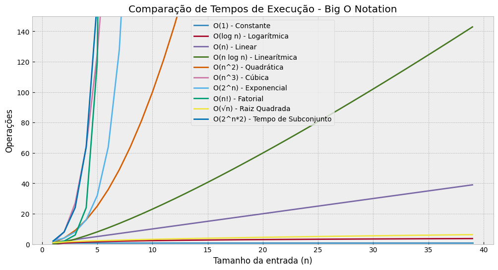

### Introdução

Se você já se aventurou pelo mundo da programação e desenvolvimento de software, provavelmente já se deparou com o termo "Big O Notation". Mas o que isso realmente significa e por que é tão crucial entender essa notação ao lidar com algoritmos?

A Big O Notation é uma maneira de classificar algoritmos com base no tempo e espaço que eles consomem à medida que os dados de entrada crescem. Ao compreender essa notação, você será capaz de escolher algoritmos que escalam melhor, aumentando a performance e eficiência das suas aplicações. Neste artigo, vamos explorar o que é a Big O, para que serve, e discutir os 10 tipos mais comuns de notação. Além disso, incluiremos exemplos de código em Python para cada tipo de Big O.

### O que é a Big O Notation?

A Big O Notation é usada para descrever o desempenho de um algoritmo em termos de tempo ou espaço, especialmente quando o tamanho da entrada cresce. Em outras palavras, ela te ajuda a entender como o tempo de execução (ou a quantidade de memória utilizada) aumenta à medida que você lida com mais dados.

### Para que serve a Big O Notation?

- **Desempenho**: Ajuda a avaliar o tempo que um algoritmo levará para ser executado em relação ao tamanho da entrada.
- **Escalabilidade**: Permite que você saiba se o algoritmo funcionará bem para entradas maiores, algo essencial ao trabalhar com grandes volumes de dados.
- **Comparação de Algoritmos**: Auxilia na escolha entre diferentes algoritmos, permitindo optar por aquele que terá melhor desempenho com uma determinada quantidade de dados.

### A Importância de Identificar a Complexidade

Saber identificar a complexidade dos algoritmos que você usa pode fazer uma enorme diferença no desempenho do seu código. Um algoritmo que funciona bem em dados pequenos pode se tornar inviável em uma aplicação de grande escala se ele tiver uma complexidade alta.

### Tipos de Complexidade: Tempo e Espaço

Há dois principais tipos de complexidade que podem ser analisados com Big O:

- **Complexidade de Tempo**: Refere-se ao tempo que o algoritmo leva para ser executado conforme o tamanho da entrada cresce.
- **Complexidade de Espaço**: Refere-se à quantidade de memória que o algoritmo consome conforme o tamanho da entrada aumenta.

Agora, vamos explorar os **10 Big O Notations mais utilizados**, como calculá-los, suas características e exemplos de código.

---

### 1. **O(1): Constante**

A complexidade O(1) significa que o tempo de execução do algoritmo não depende do tamanho da entrada; ele será constante, não importa o quão grande o input seja.

#### Características:

- O tempo de execução é constante.
- Exemplo típico: acessar um elemento de um array por índice.

#### Exemplo de Algoritmo e Código em Python:

```python
def acessar_elemento(arr, index):
    return arr[index]

# Independente do tamanho de arr, a operação sempre leva o mesmo tempo.
array = [10, 20, 30, 40, 50]
print(acessar_elemento(array, 2))  # Saída: 30
```

### 2. **O(log n): Logarítmica**

O tempo de execução cresce em proporção ao logaritmo do tamanho da entrada. Algoritmos que dividem repetidamente a entrada em partes menores possuem essa complexidade.

#### Características:

- Muito eficiente para grandes entradas.
- Exemplo típico: busca binária.

#### Exemplo de Algoritmo e Código em Python:

```python
def busca_binaria(arr, valor):
    inicio, fim = 0, len(arr) - 1
    while inicio <= fim:
        meio = (inicio + fim) // 2
        if arr[meio] == valor:
            return meio
        elif arr[meio] < valor:
            inicio = meio + 1
        else:
            fim = meio - 1
    return -1

array = [10, 20, 30, 40, 50]
print(busca_binaria(array, 30))  # Saída: 2
```

### 3. **O(n): Linear**

O tempo de execução cresce linearmente com o tamanho da entrada. Cada elemento da entrada é processado uma vez.

#### Características:

- O tempo de execução aumenta diretamente com o tamanho da entrada.
- Exemplo típico: percorrer um array.

#### Exemplo de Algoritmo e Código em Python:

```python
def encontrar_elemento(arr, valor):
    for i in range(len(arr)):
        if arr[i] == valor:
            return i
    return -1

array = [10, 20, 30, 40, 50]
print(encontrar_elemento(array, 40))  # Saída: 3
```

### 4. **O(n log n): Linearítmica**

Essa notação aparece em muitos algoritmos de ordenação eficientes, como o merge sort e o quicksort. O tempo de execução é proporcional ao tamanho da entrada vezes o logaritmo da entrada.

#### Características:

- Comum em algoritmos de ordenação.
- Exemplo típico: merge sort.

#### Exemplo de Algoritmo e Código em Python:

```python
def merge_sort(arr):
    if len(arr) > 1:
        meio = len(arr) // 2
        esquerda = arr[:meio]
        direita = arr[meio:]

        merge_sort(esquerda)
        merge_sort(direita)

        i = j = k = 0
        while i < len(esquerda) and j < len(direita):
            if esquerda[i] < direita[j]:
                arr[k] = esquerda[i]
                i += 1
            else:
                arr[k] = direita[j]
                j += 1
            k += 1

        while i < len(esquerda):
            arr[k] = esquerda[i]
            i += 1
            k += 1

        while j < len(direita):
            arr[k] = direita[j]
            j += 1
            k += 1

array = [38, 27, 43, 3, 9, 82, 10]
merge_sort(array)
print(array)  # Saída: [3, 9, 10, 27, 38, 43, 82]
```

### 5. **O(n^2): Quadrática**

Aqui, o tempo de execução cresce proporcionalmente ao quadrado do tamanho da entrada. Isso ocorre quando um algoritmo precisa comparar todos os pares de elementos, como o caso de ordenação por bolha (bubble sort).

#### Características:

- Ineficiente para grandes entradas.
- Exemplo típico: bubble sort.

#### Exemplo de Algoritmo e Código em Python:

```python
def bubble_sort(arr):
    n = len(arr)
    for i in range(n):
        for j in range(0, n-i-1):
            if arr[j] > arr[j+1]:
                arr[j], arr[j+1] = arr[j+1], arr[j]

array = [64, 34, 25, 12, 22, 11, 90]
bubble_sort(array)
print(array)  # Saída: [11, 12, 22, 25, 34, 64, 90]
```

### 6. **O(n³) - Complexidade Cúbica**

A complexidade **O(n³)** surge em algoritmos cujo tempo de execução cresce de forma proporcional ao cubo do tamanho da entrada. Isso significa que, se o número de elementos na entrada aumentar, o número de operações necessárias aumenta de forma cúbica. Esse tipo de complexidade é comum em problemas que envolvem três níveis de iterações aninhadas (loops).

#### Características de O(n³):

- **Crescimento Rápido**: Algoritmos cúbicos são muito mais lentos para grandes entradas comparados a algoritmos de complexidade linear ou quadrática. Se o tamanho da entrada for 10, o algoritmo terá 1.000 operações; se o tamanho for 100, terá 1.000.000 operações.
- **Uso Típico**: Algoritmos com três laços aninhados ou manipulações em matrizes 3D frequentemente resultam em complexidade cúbica.

#### Exemplo Clássico de Algoritmo com O(n³):

Um exemplo clássico de algoritmo cúbico é a **multiplicação de matrizes** de tamanho \(n \times n\). O algoritmo ingênuo de multiplicação de matrizes requer três laços aninhados para calcular o produto de duas matrizes.

#### Código Python para O(n³):

```python
# Função para multiplicar duas matrizes de forma cúbica
def multiplicar_matrizes(A, B):
    # Tamanho das matrizes
    n = len(A)
    # Matriz resultante
    C = [[0 for _ in range(n)] for _ in range(n)]

    # Três laços aninhados - Complexidade cúbica O(n³)
    for i in range(n):
        for j in range(n):
            for k in range(n):
                C[i][j] += A[i][k] * B[k][j]

    return C

# Exemplo de uso
A = [[1, 2], [3, 4]]
B = [[5, 6], [7, 8]]
resultado = multiplicar_matrizes(A, B)
print("Resultado da multiplicação de matrizes:")
for linha in resultado:
    print(linha)
```

#### Explicação:

- O algoritmo acima multiplica duas matrizes \(A\) e \(B\), resultando em uma matriz \(C\).
- Existem três laços aninhados: um para percorrer as linhas da matriz \(A\), outro para percorrer as colunas da matriz \(B\), e um terceiro para calcular o produto da soma parcial. Isso leva à complexidade cúbica **O(n³)**, pois o número de operações necessárias cresce exponencialmente à medida que \(n\) aumenta.

#### Desempenho:

- Para pequenas entradas, a diferença entre **O(n²)** e **O(n³)** pode não ser muito perceptível. No entanto, à medida que o tamanho da entrada cresce, um algoritmo cúbico torna-se impraticável em termos de tempo de execução.

### 7. **O(2^n): Exponencial**

A complexidade exponencial surge quando o número de operações dobra a cada aumento no tamanho da entrada. Um exemplo clássico são os problemas que envolvem todas as combinações possíveis de um conjunto de itens, como a resolução de problemas de decisão por força bruta.

#### Características:

- O tempo de execução cresce rapidamente com o aumento da entrada.
- Exemplo típico: a sequência de Fibonacci com uma abordagem recursiva.

#### Exemplo de Algoritmo e Código em Python:

```python
def fibonacci(n):
    if n <= 1:
        return n
    return fibonacci(n-1) + fibonacci(n-2)

print(fibonacci(5))  # Saída: 5
```

Neste exemplo, para calcular Fibonacci de 5, o número de operações dobra a cada incremento de n, resultando em tempos de execução drasticamente maiores para valores maiores.

### 8. **O(√n): Raiz Quadrada**

A complexidade O(√n) é relativamente rara, mas pode aparecer em algoritmos que envolvem a busca em espaços que podem ser divididos em quadrantes ou que possuem uma estrutura de raiz quadrada, como na busca em intervalos.

#### Características:

- Exemplo típico: busca no método do salto (Jump Search).

#### Exemplo de Algoritmo e Código em Python:

```python
import math

def jump_search(arr, valor):
    n = len(arr)
    passo = int(math.sqrt(n))
    prev = 0

    while arr[min(passo, n)-1] < valor:
        prev = passo
        passo += int(math.sqrt(n))
        if prev >= n:
            return -1

    for i in range(prev, min(passo, n)):
        if arr[i] == valor:
            return i
    return -1

array = [0, 1, 2, 3, 4, 5, 6, 7, 8, 9]
print(jump_search(array, 6))  # Saída: 6
```

Este algoritmo busca de maneira mais eficiente em uma lista ordenada, dividindo a lista em blocos de tamanho √n.

### 9. **O(n!): Fatorial**

Esta complexidade aparece em algoritmos que tentam resolver problemas de permutação e combinação, como o "Problema do Caixeiro Viajante" (Travelling Salesman Problem). O tempo de execução cresce muito rapidamente, tornando-o ineficaz para grandes entradas.

#### Características:

- Exemplo típico: permutações de um conjunto.

#### Exemplo de Algoritmo e Código em Python:

```python
import itertools

def permutacoes(arr):
    return list(itertools.permutations(arr))

array = [1, 2, 3]
print(permutacoes(array))
```

Aqui, o algoritmo gera todas as permutações possíveis de um array, o que, para entradas grandes, pode se tornar impraticável devido à complexidade fatorial.

### 10. **O(2^n \* n): Tempo de Subconjunto**

Alguns algoritmos de decisão ou otimização possuem uma complexidade que combina o fator exponencial com a multiplicação do número de elementos da entrada, como ocorre no algoritmo de programação dinâmica que resolve o problema da Mochila (Knapsack Problem).

#### Características:

- Exemplo típico: resolver problemas de subconjuntos (subsets) com otimização.

#### Exemplo de Algoritmo e Código em Python (Problema da Mochila):

```python
def knapsack(capacidade, pesos, valores, n):
    if n == 0 or capacidade == 0:
        return 0
    if pesos[n-1] > capacidade:
        return knapsack(capacidade, pesos, valores, n-1)
    else:
        return max(valores[n-1] + knapsack(capacidade-pesos[n-1], pesos, valores, n-1),
                   knapsack(capacidade, pesos, valores, n-1))

valores = [60, 100, 120]
pesos = [10, 20, 30]
capacidade = 50
n = len(valores)
print(knapsack(capacidade, pesos, valores, n))  # Saída: 220
```

Este algoritmo resolve o problema da mochila, decidindo quais itens maximizarão o valor dentro de um limite de peso.

### Comparativo dos Tempos de Execução

Para visualizar as diferenças de eficiência entre essas diferentes complexidades de Big O, vamos gerar um gráfico comparativo. Esse gráfico ajudará a entender como o tempo de execução cresce à medida que o tamanho da entrada aumenta para cada tipo de Big O Notation discutido.

A seguir, vou gerar um gráfico comparativo dos tempos de execução teóricos dessas notações, assumindo um tamanho de entrada crescente.

Aqui está o gráfico comparativo dos tempos de execução para diferentes tipos de complexidade da Big O Notation. O gráfico utiliza uma escala logarítmica no eixo Y para facilitar a visualização das diferenças entre as notações, especialmente para crescimentos exponenciais e fatoriais. Ele mostra como o número de operações aumenta com o crescimento da entrada para cada uma das complexidades discutidas.



Isso ilustra a importância de escolher algoritmos adequados, especialmente para entradas grandes, pois algoritmos com complexidades como O(n²), O(2ⁿ) e O(n!) tornam-se rapidamente inviáveis.

### Mas por que logaritmos são usados?

Logaritmos são frequentemente usados para mensurar a complexidade de algoritmos porque eles descrevem como o tempo de execução ou a quantidade de recursos necessários cresce de maneira muito mais lenta do que o tamanho da entrada. Em particular, a complexidade **O(log n)** surge em algoritmos que repetidamente dividem o problema em partes menores.

1. **Redução Recursiva**: Em muitos algoritmos, como a busca binária, o tamanho do problema é dividido pela metade a cada iteração. Essa operação de "metade de metade" é bem modelada por um logaritmo. No caso de busca binária, o logaritmo base 2 (log₂) nos diz quantas vezes podemos dividir um conjunto até que reste apenas um único elemento.

   - Por exemplo, se você tem 16 elementos, o número de divisões necessárias até restar um único elemento é log₂(16) = 4. Isso é muito mais eficiente do que verificar todos os 16 elementos um por um.

2. **Crescimento mais Lento**: Logaritmos crescem muito mais lentamente que funções lineares ou quadráticas. Isso significa que um algoritmo com complexidade O(log n) será significativamente mais eficiente para entradas grandes em comparação com algoritmos de complexidade linear ou maior.

   - Comparando, se o tamanho da entrada for 1.000.000:
     - Para O(n), seriam 1.000.000 operações.
     - Para O(log n), seriam apenas 20 operações (log₂(1.000.000) ≈ 20).

3. **Eficiência em Algoritmos de Divisão e Conquista**: Algoritmos de **divisão e conquista**, como a ordenação rápida (_quick sort_) e a ordenação por mesclagem (_merge sort_), também se beneficiam da lógica logarítmica. A cada etapa, o problema é dividido em dois subproblemas menores, e o número total de passos necessários para resolver o problema completo se ajusta a um comportamento logarítmico.

4. **Escalabilidade**: Em grandes sistemas, como bancos de dados ou servidores, algoritmos que lidam com muitos dados costumam usar estruturas que têm desempenho O(log n), como árvores balanceadas, para garantir que mesmo à medida que os dados aumentam, o número de operações se mantenha pequeno. Isso faz com que o sistema escale bem.

### Exemplo de Uso de Logarítimos: Busca Binária

A **busca binária** é um dos exemplos mais conhecidos de um algoritmo que funciona com complexidade O(log n). O algoritmo divide o conjunto de dados pela metade a cada iteração, procurando em qual lado está o elemento desejado.

- Exemplo: Em uma lista ordenada de 1024 elementos, uma busca linear levaria até 1024 comparações no pior caso, enquanto uma busca binária levaria apenas log₂(1024) = 10 comparações no pior caso.

Assim, algoritmos que têm essa propriedade de reduzir pela metade ou trabalhar com subdivisões constantes tendem a ter complexidade logarítmica, sendo muito eficientes para grandes conjuntos de dados.

### Conclusão

Entender a Big O Notation é fundamental para qualquer desenvolvedor que deseja criar aplicações eficientes e escaláveis. Ao dominar esses conceitos, você será capaz de avaliar o desempenho dos seus algoritmos e tomar decisões mais embasadas sobre qual utilizar, dependendo da escala da aplicação.

Lembre-se de que otimizar a performance é um balanço entre tempo e espaço. Nem sempre o algoritmo mais rápido em tempo será o mais eficiente em termos de uso de memória.
